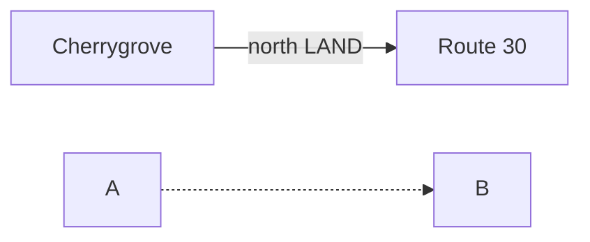

# Mermaid Map Stitcher

`stitch_mermaid_maps.py` turns a Mermaid flowchart plus a folder of town/route images into one repeatable high-resolution composite.

## Why this exists

For Plastic Ox, the Mermaid file is the source of truth for **topology**. The image folder supplies the actual imported town/route maps. This keeps layout review repeatable:

1. change the Mermaid graph,
2. add/remove/replace source images,
3. rerun one command,
4. compare the new composite.

The script never downloads images. It only works with files you put in the image folder.

## Requirements

- Python 3.10+
- Pillow
- PyYAML (only required for override files)
- Graphviz (`dot` executable)

Install Python packages:

```bash
pip install pillow pyyaml
```

Graphviz:

- macOS: `brew install graphviz`
- Ubuntu/Debian: `sudo apt install graphviz`
- Windows: install Graphviz and add its `bin` directory to `PATH`

## Recommended folder layout

```text
plastic-ox-layout/
├── plastic_ox_physical_layout_v0.3.mmd
├── stitch_mermaid_maps.py
├── ports.yaml                 # optional
└── map_images/
    ├── START.png
    ├── R29.png
    ├── CHERRY.png
    ├── R30.png
    ├── R31.png
    ├── RUST.png
    ├── R3.png
    ├── AZA.png
    └── ...
```

**Using Mermaid node IDs as filenames is strongly recommended.**

The program can also match names such as `cherrygrove.png` to `CHERRY["Cherrygrove"]`, but node IDs are unambiguous and survive label edits.

## Basic render

```bash
python stitch_mermaid_maps.py \
  plastic_ox_physical_layout_v0.3.mmd \
  map_images \
  plastic_ox_composite.png
```

Source images are kept at their prepared pixel resolution. The final canvas expands to fit them; it does not first shrink everything into a fixed screenshot-sized output.

Useful layout controls:

```bash
python stitch_mermaid_maps.py \
  map.mmd map_images output.png \
  --gap-px 220 \
  --padding-px 300 \
  --edge-width 12
```

## Preview before every image exists

```bash
python stitch_mermaid_maps.py \
  map.mmd map_images preview.png \
  --allow-missing
```

Missing maps become labeled placeholders, which is useful while iterating on topology.

## Exact junction points

A Mermaid graph can say:

```mermaid
CHERRY --> R30
```

but it does not say where the north exit is in `CHERRY.png`.

By default, the stitcher attaches the connector to the image side facing the other node. That is sufficient for topology/layout reviews.

For exact exit placement, generate an override template:

```bash
python stitch_mermaid_maps.py \
  map.mmd map_images unused.png \
  --write-overrides-template ports.yaml
```

Then edit `ports.yaml`.

Example:

```yaml
nodes:
  CHERRY:
    image: CHERRY.png
    rotate: 0
    scale: 1.0
    ports:
      east_land: [1.0, 0.58]
      north_land: [0.67, 0.0]
      west_water: [0.0, 0.42]

  R30:
    image: R30.png
    ports:
      south: [0.48, 1.0]

edges:
  CHERRY->R30:
    source_port: north_land
    target_port: south
```

Coordinates between `0` and `1` are normalized image coordinates:

- `[0, 0]` = top-left
- `[1, 0]` = top-right
- `[0, 1]` = bottom-left
- `[1, 1]` = bottom-right

That means the port definitions continue to work even if a tile is scaled.

Compass names (`north`, `east`, `south`, `west`) work automatically and do not need to be declared.

## Per-image transforms

The same YAML supports crop, rotation, and scale:

```yaml
nodes:
  R119:
    image: route_119.png
    crop:
      left: 12
      top: 8
      right: 16
      bottom: 20
    rotate: 90
    scale: 1.25
```

Rotation happens before scale. Port coordinates are evaluated against the transformed image.

## Mermaid subset

The parser handles the node/edge forms used by the Plastic Ox flowcharts:



Styling declarations, `classDef`, `class`, and subgraph styling are ignored for the stitched map. The graph topology is what matters.

## Region view (snap layout)

`--snap` replaces the Graphviz layout with a flush "region view": the graph is
walked breadth-first from the first declared node (or `--snap-root`), and each
image is placed directly against its parent so the junction points touch.

- Compass directions come from the edge labels themselves
  (`"W↔E LAND"` = source exits west, target enters east; `N/E↔W` takes the
  last option; `"Badge 8 → north gate"` works too).
- Junction points default to the midpoint of the connecting side. Exact
  points from `--overrides ports.yaml` (including per-edge `source_port` /
  `target_port`) take precedence.
- Solid edges form the skeleton first; dashed branches attach afterwards.
  Blocked placements are pushed out along the travel direction (junctions
  stay aligned), then nudged perpendicular, then tried on the remaining
  compass sides.
- Edges that cannot snap (cycle links such as the Magnet Train's second
  stop, or Dark Cave's second and third cave ports) are drawn as connectors.
- Snapped junctions are marked with a short seam line and dot; red means a
  dashed (optional/branch) connection.
- Graphviz is not required in this mode.

```bash
python stitch_mermaid_maps.py map.mmd map_images region.png \
  --snap --overrides ports.yaml --edge-labels
```

It is a loose visual assembly, not a tile-exact optimizer: port midpoints
rarely coincide with the real road pixel, so expect seams that are
topologically correct but not cartographically perfect. Tighten individual
junctions by recording exact coordinates in `ports.yaml`.

## What the current version does not do automatically

It does **not** infer the exact road/water/cave pixel inside a source map. That information is not present in ordinary Mermaid syntax.

For a true edge-to-edge world-map assembly, use `ports.yaml` to record each natural junction once. That metadata then remains reusable across every future Mermaid revision.

A later version can also use those same ports as constraints in a geometric optimizer, so compatible route/town exits physically snap together rather than merely being connected by a short visible seam.
